# Quiz app 🔥

# Tech stack : PostgreSQL, Nodejs, Express js, React js
1. git clone
2. npm install
3. copy the .env file from envFile
4. cd client
5. npm install
6. npm run start
7. move back to server
8. npm run start
11. I have added the login details on Admin and User Login Screen.
    
# Working  
1. So, I have used PERN stack for this particular app and sequelize as an ORM.
2. It is fully dynamic, excluding some stuffs that can not be done from frontend.
3. User can login and register thorogh it's relavant pages.
4. One user can have multiple roles. As of now I have included user,admin,moderator roles.
5. Admin creation has been done via seeder files. (We can add user roles edit feature.)
6. Admin can view the languages which are active. Languages arw coming from server.
7. Each languages can have multiple exercises.
8. Exercise has the questions, weightage, totalMarks.
9. Admin can add, update, delete, activate, deactivate the exercises.
10. Admin will decide which exercise will be easy, medium, hard by adding the question, marks and weightage to it.
11. In question module question, It can have only 4 options and one correct answer. (We can add multiple options adding and multiple correct option feature.)
12. Once admin add the exercise by default it will be set to deactivate. 
13. Only after adding the questions to that particular exercise and adding the weightage admin can activate the exercise.
14. If the exercise is active it will be shown to the user dashboard.
15. Coming to the user dashboard, user can manage the language preference.
16. As of now users can add the language preference and can not perform any other actions on it such as removing the preference.
17. After adding the preference they can view the exercises and give the quizzes.
18. After completing the quiz they can see the obtained marks and result.
19. Users can also view the leaderboard by languages. They can view their own progess and can reset the progress if they want.
20. User proficiency has been calculated by ((obtained marks/ total marks) * exerciseWeightage).
21. On admin panel admin can view the all users list.

Postman collection link : 
https://api.postman.com/collections/24529476-593677a2-669c-4565-b009-6bbd0266716f?access_key=PMAT-01HBP2KXJAG3DQPG0HKDX1QAGB

Note : 
- The response time of the apis might be slower as I am using neon tech' online PostgreSQL.
- Let me know if you're facing any errors in setting up the project or in the database.
- Contact :
  📩 - urvishfunnels@gmail.com
  📞 - 9512120054

# Screenshots
home

register

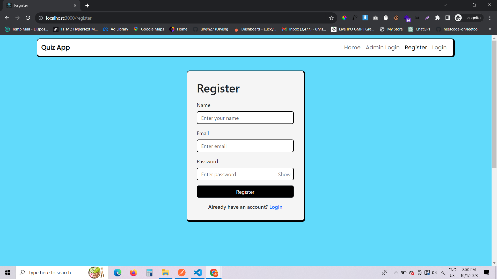

login

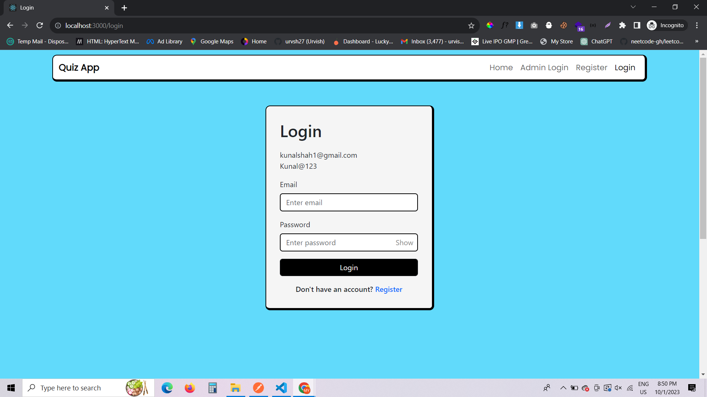

adminLogin

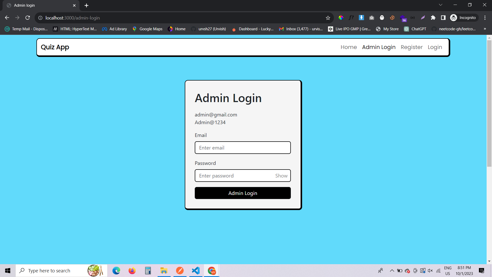

adminLanguages

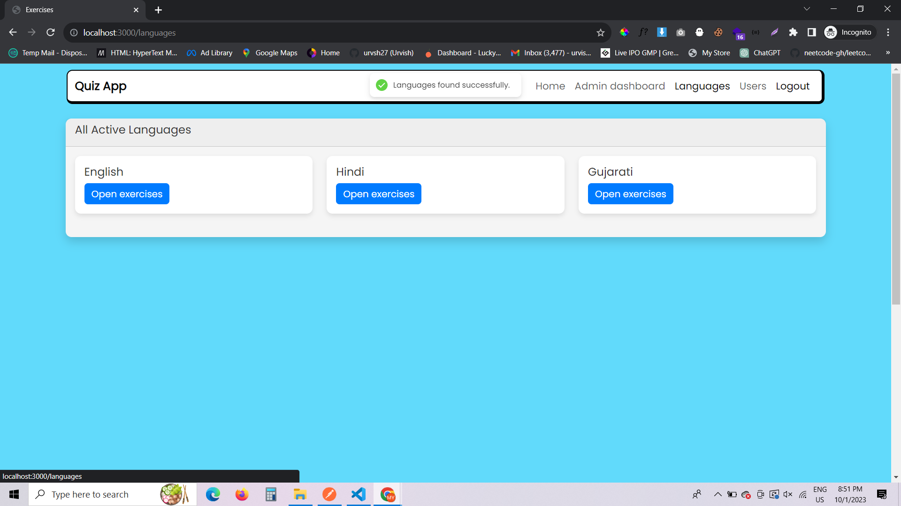

adminExercise1

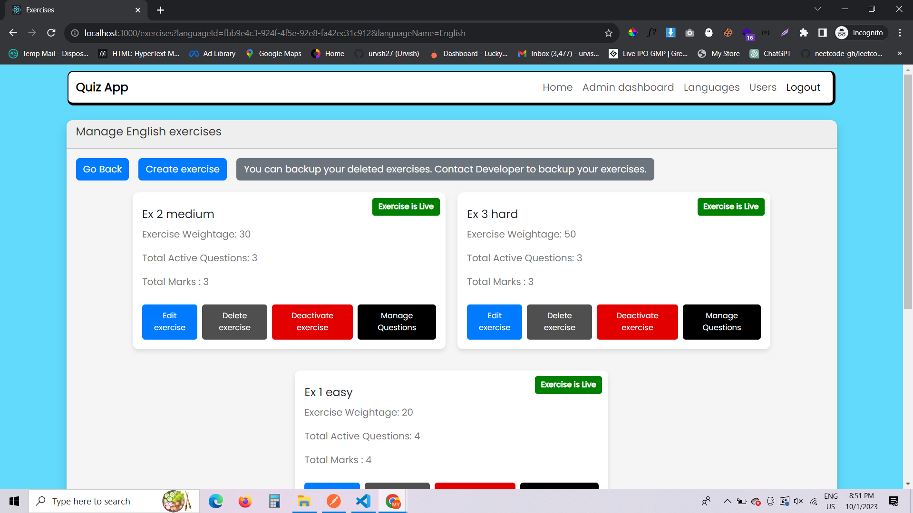

adminExercise2

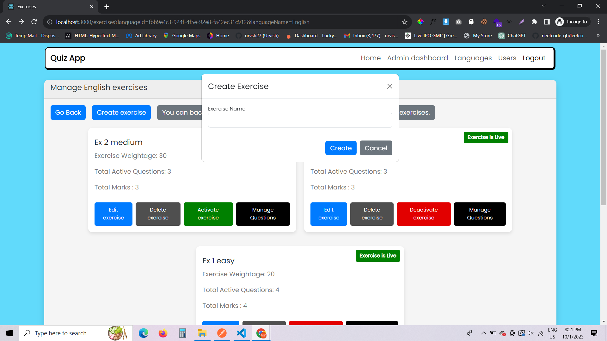

adminExercise3

adminQuestion1

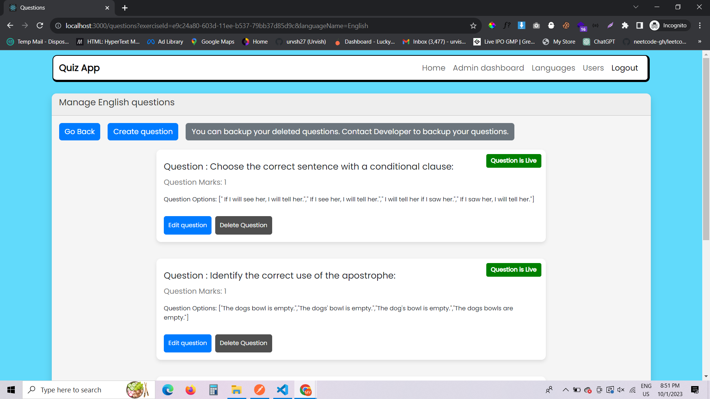

adminQuestion2

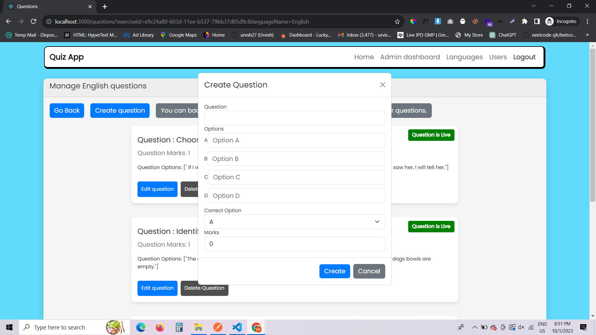

adminQuestion3

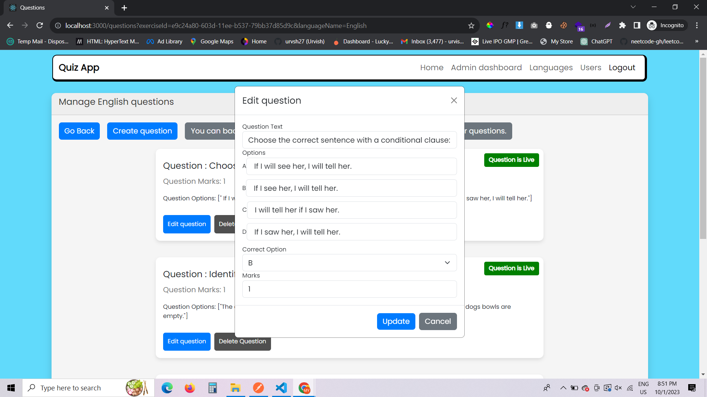

allUsers

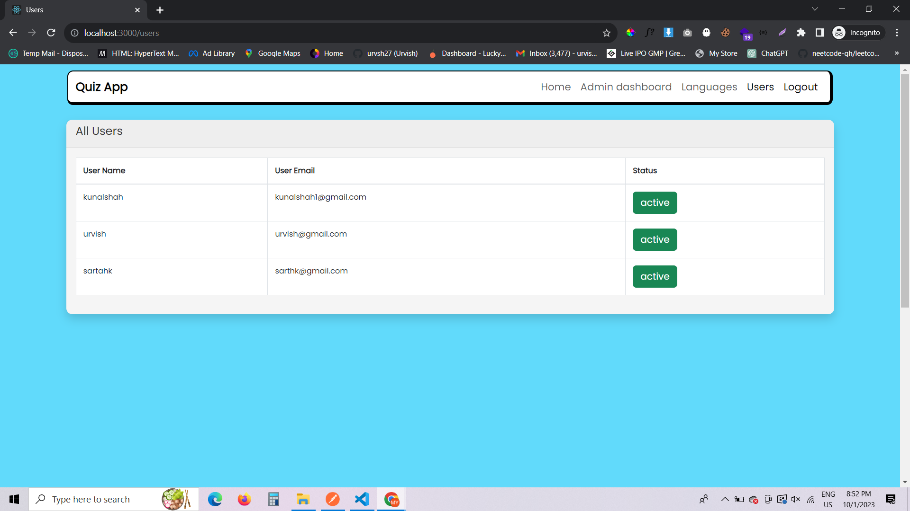

userDashboard

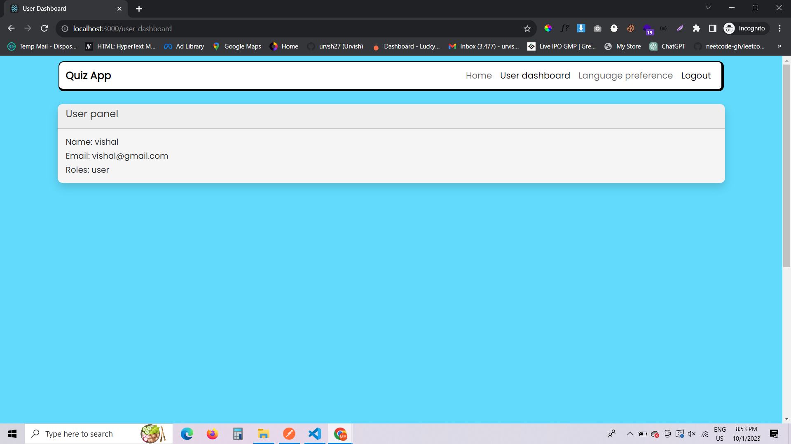

userLanguagePreference1

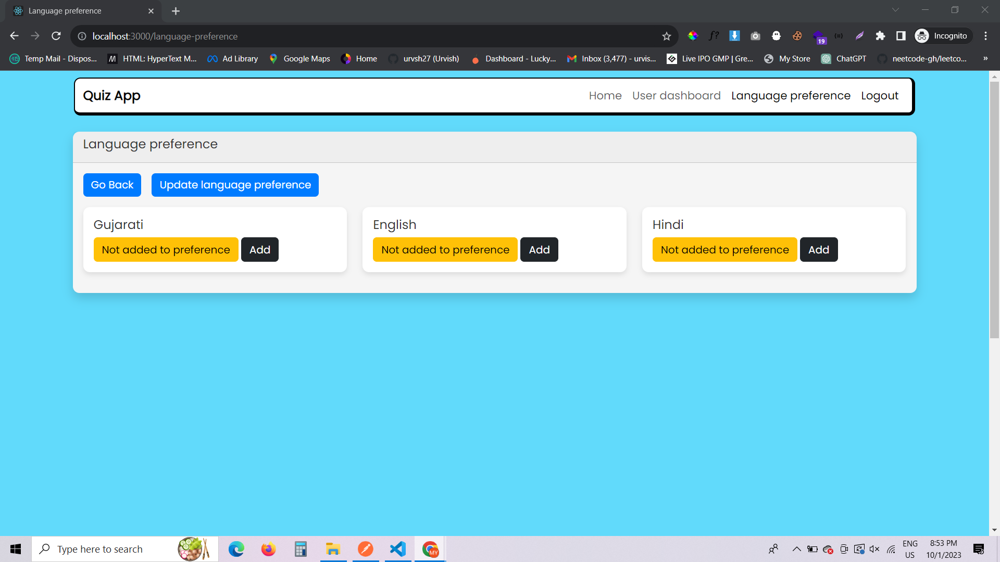

userLanguagePreference2

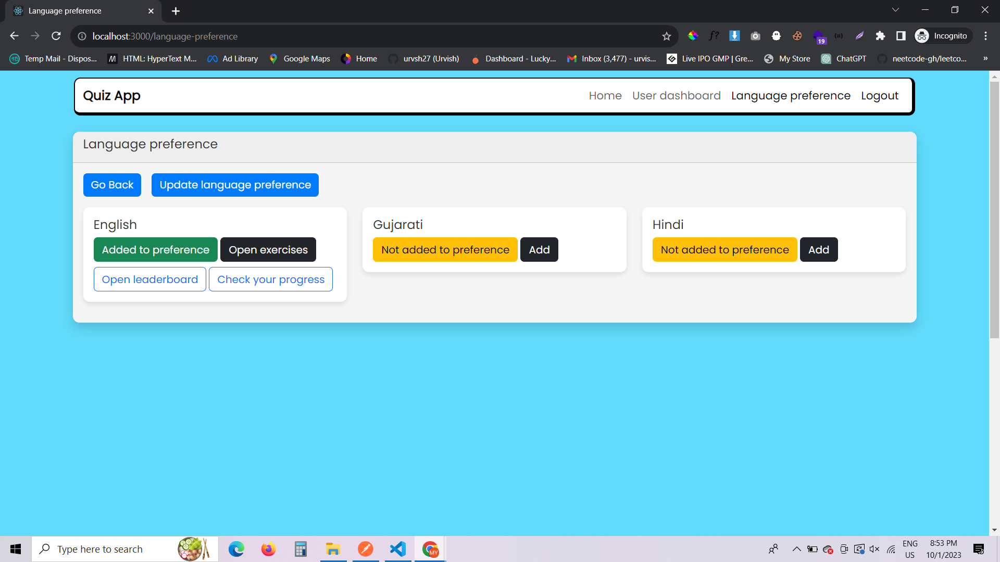

userExercise

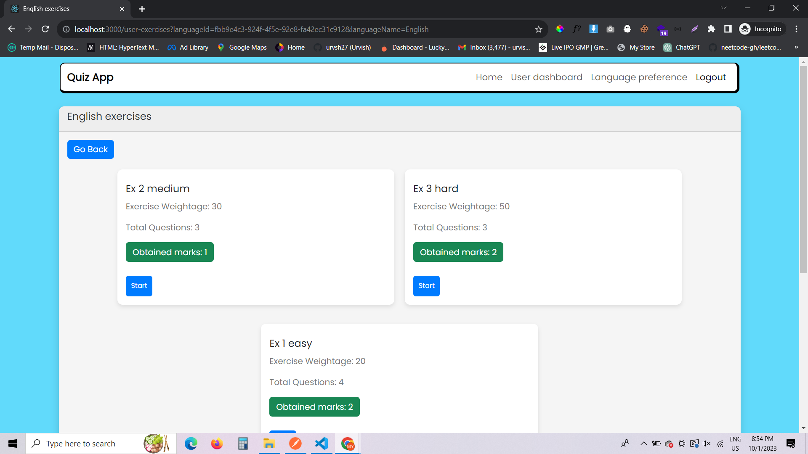

userQuiz1

userQuiz2

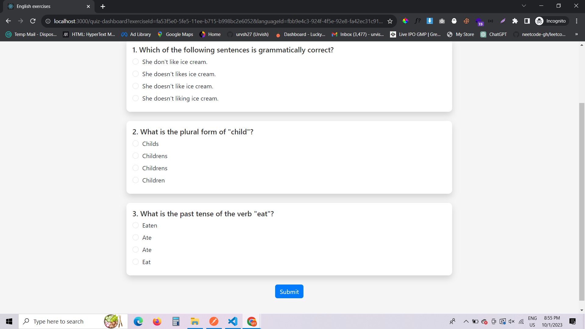

userProgress

languageLeaderboard

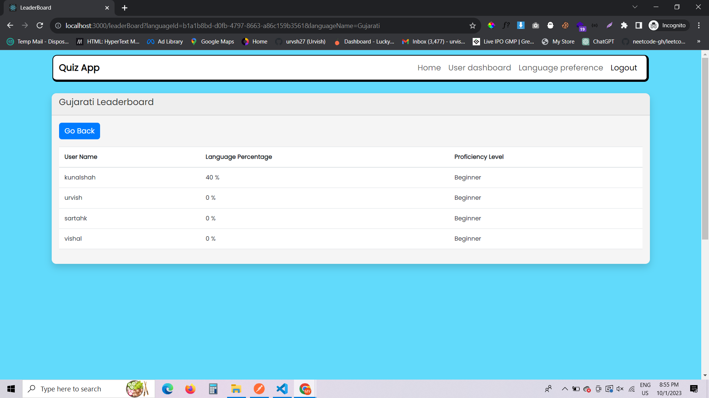

