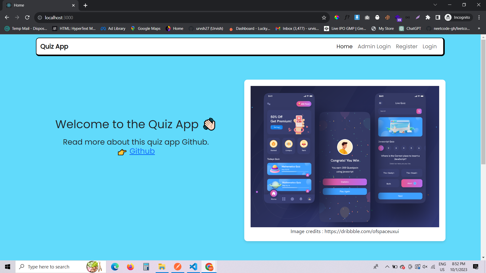

# Quiz app

# Tech stack : PostgreSQL, Nodejs, Express js, React js
1. git clone
2. npm install
3. cd client
4. npm install
5. move back to server
6. npm run start
7. then run the seeder command : npx sequelize-cli db:seed:all
8. It will start the client and server
9. I have not removed the env file for ease.

# Screenshots

